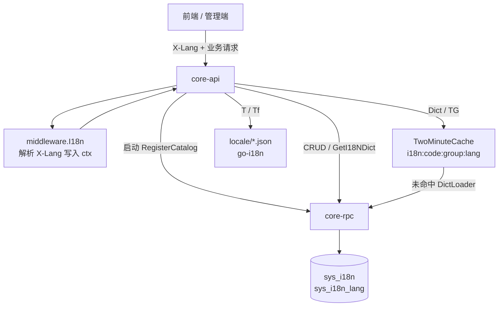
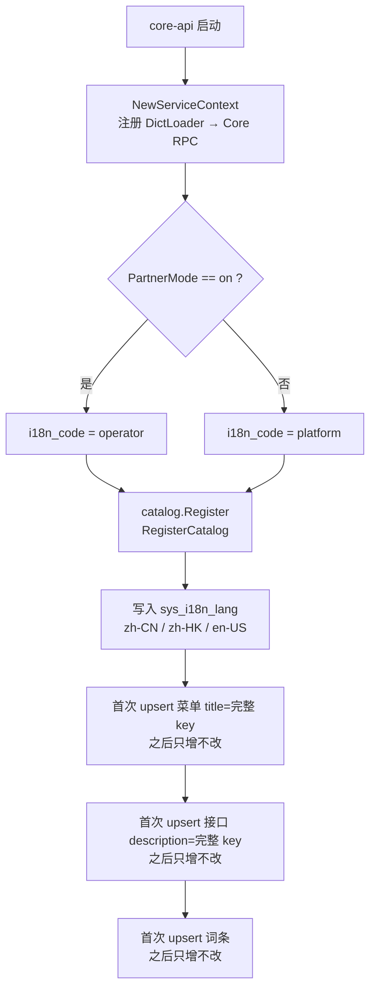
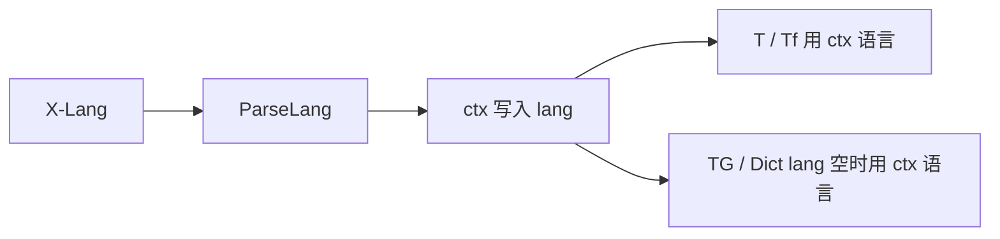
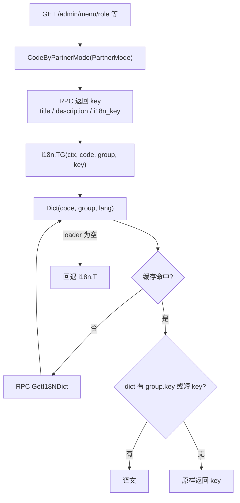
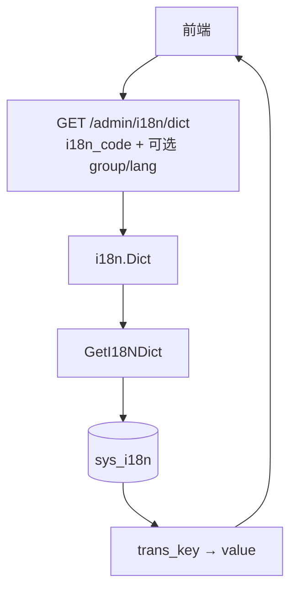
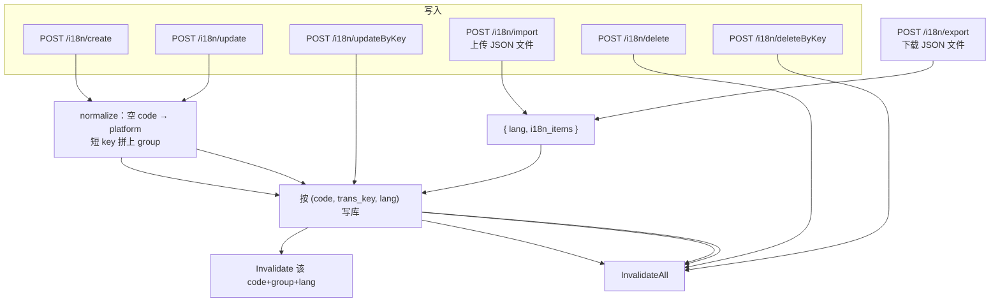
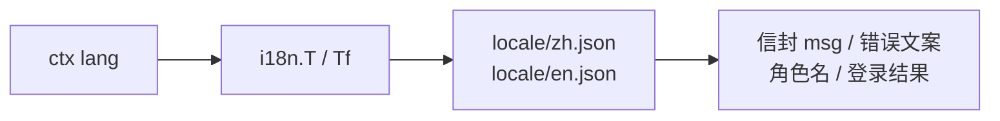

# 多语言使用流程

接口字段与请求示例见 [api.md](./api.md)。

`i18n_code` 隔离的是**业务站点/服务**（`platform` / `operator` / `agent`），不是租户 `operator_code`。语言表 `sys_i18n_lang` 全局一份。

## 数据怎么存

| 维度           | 取值                                  | 说明                        |
| ------------ | ----------------------------------- | ------------------------- |
| `i18n_code`  | `platform` / `operator` / `promo` … | 站点。空则当作 `platform`        |
| `i18n_group` | `menu` / `api` / `front` / `login` / `lang` | 分组                        |
| `trans_key`  | `menu.route.dashboard`              | 完整 key；写入时短 key 会拼上 group |
| `lang`       | `zh-CN` / `zh-HK` / `en-US` …       | 必须已在 `sys_i18n_lang`      |

唯一约束：`(i18n_code, trans_key, lang)`。

两条翻译通道：

- `i18n.T` **/** `Tf`：进程内 `locale/zh.json`、`locale/en.json`。信封 `msg`、角色名、登录结果等走这里。
- `i18n.TG` **/** `Dict`：查 `sys_i18n`，进程内缓存 2 分钟。菜单标题、接口说明、前端词条、语言显示名走这里。

## 总览

## 1. 启动：按 PartnerMode 灌词条

`core.yaml`：`PartnerMode=off` → `platform`（18000）。  
`core2.yaml`：`PartnerMode=on` → `operator`（18100）。

菜单、接口在库里存的是 **key**，不是译文。译文只在 `sys_i18n`。

## 2. 每个请求先定语言

请求头 `X-Lang`。缺省 `zh-CN`。`zh*` → `zh-CN`（`zh-HK` 除外），`en*` → `en-US`，其余原样。

## 3. 服务端翻译菜单 / 接口 / 语言名

按角色菜单、菜单列表、创建菜单、接口列表、创建接口、语言列表、已开启语言、创建语言都会带上当前 API 的站点 code。

语言行在 `sys_i18n_lang` 存 `name`（回退原文）和 `i18n_key`（完整 trans_key，如 `lang.zh-CN`）。HTTP 出参 `name` 仍是原文，`i18n_key` 是 key，`i18n_name` 是译文。词条在 `sys_i18n` 的 `lang` 组，可在词条管理里改。

出参约定：

- 按角色菜单：`title` 已是译文。
- 菜单管理：`title` 仍是 key，`trans_title` 是译文。
- 接口管理：`description` 仍是 key，`trans_description` 是译文。
- 语言列表 / 已开启语言 / 创建语言：`name` 是库里的回退原文，`i18n_key` 是 key，`i18n_name` 是译文（无词条则回退 `name`）。

`TG` 查找顺序：`menu.route.dashboard` → 短 key `route.dashboard` → 没有则返回原 key。

## 4. 前端自己拉词条

登录后切语言、渲染公共文案：`GET /admin/i18n/dict`。不进 Casbin。`i18n_code` 必传；`i18n_group` 空则该站点该语言全部组。

示例：`/admin/i18n/dict?i18n_code=platform&i18n_group=front&lang=zh-CN`

## 5. 后台改词条

语言必须先在 `sys_i18n_lang`。该语言已有词条时，不能改 `lang`、不能删语言。

`updateByKey`：`i18n_code` / `i18n_group` 有值才进 WHERE。已有同一 `trans_key` 会按已有站点一起更新；一条都没有则新建（空 code → `platform`，空 group 从 key 第一段推断）。

`deleteByKey`：按 `i18n_code` + `i18n_group` + `trans_key` 删除该 key 全部语言，不删其它站点。无匹配则 404。

导出 / 导入：一种语言一个文件。导出成功直接下发文件（不套信封），须 POST + Bearer。导入 `multipart` 字段 `file`，可选 `lang`（空则用文件 `lang`，非空必须与文件相等），按该语言 upsert，不删文件里没有的 key、不改其它语言。目标语言须已在语言表。字段与示例见 [api.md](./api.md#post-admini18nexport)。

## 6. 内置 JSON（T）

不进 `sys_i18n`，改代码才变。

## 站点对照

| 进程                   | 配置                   | PartnerMode | 注册与 TG 用的 code   |
| -------------------- | -------------------- | ----------- | ---------------- |
| 平台 core-api `:18000` | `api/etc/core.yaml`  | `off`       | `platform`       |
| 分站 core-api `:38000` | `api/etc/core2.yaml` | `on`        | `operator`       |
| 其它服务（如 promo）        | 各自 catalog           | —           | 词条自带 `i18n_code` |

