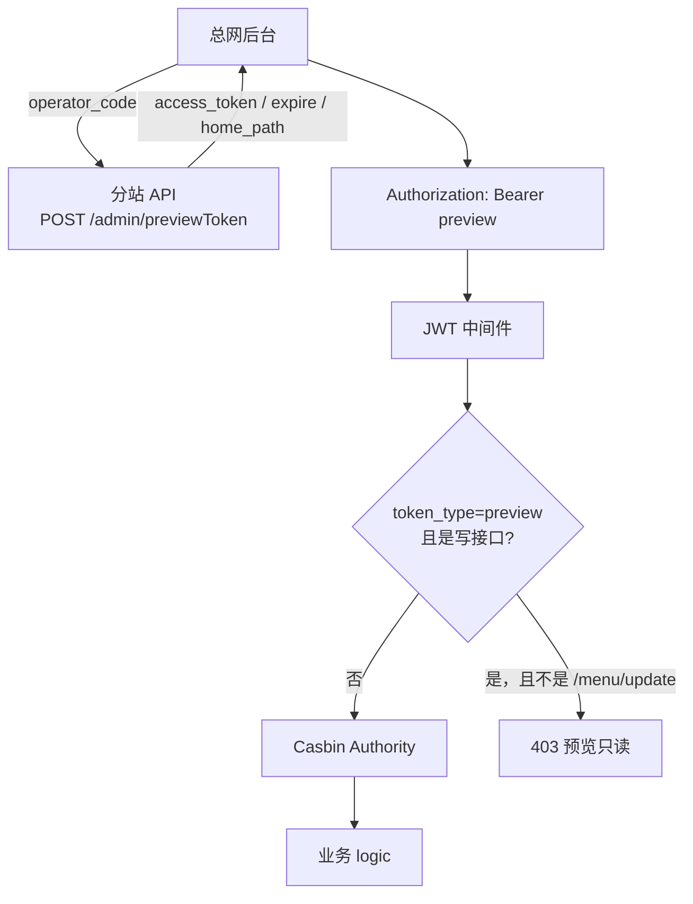
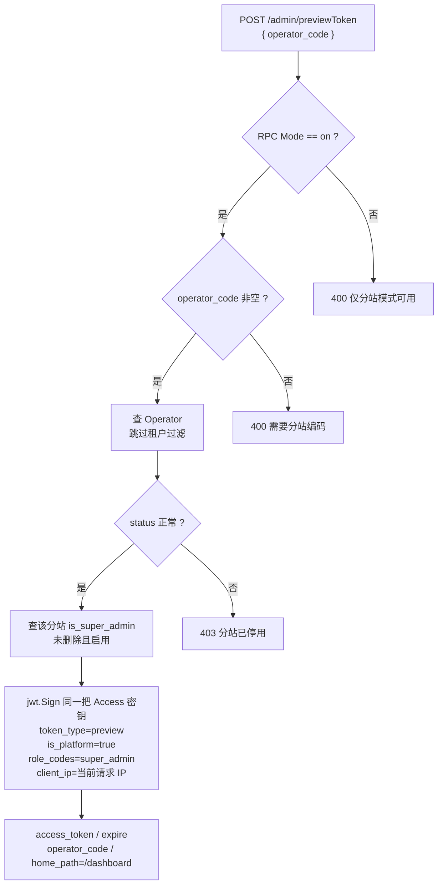
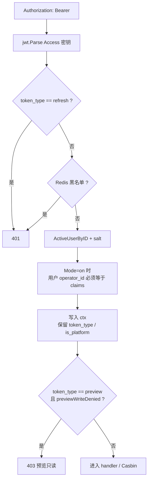
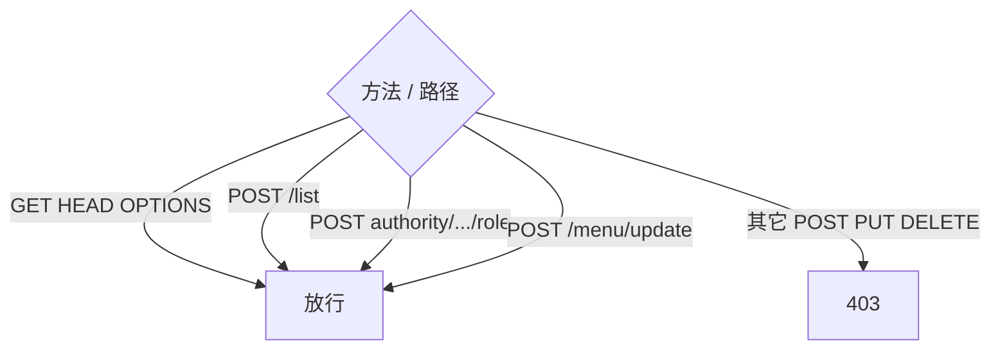
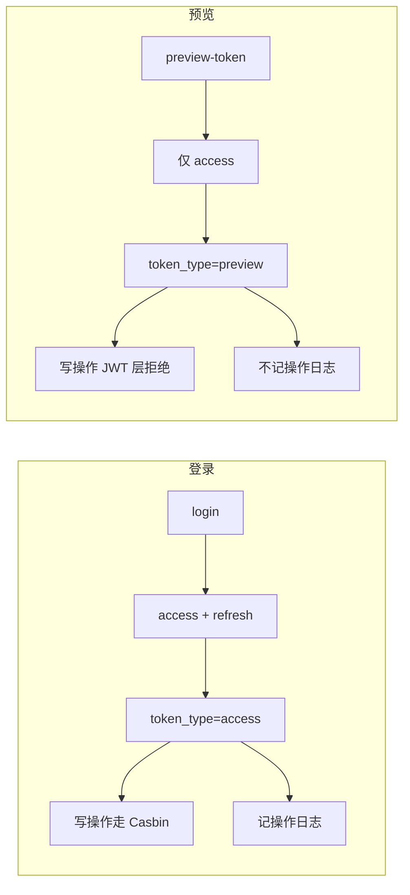

# 临时 Token（预览令牌）使用流程

接口字段见 [api.md](./api.md)。

预览令牌给**总网进分站后台只读查看**用：挂在分站超管身份上，`token_type=preview`，没有 `refresh_token`，写接口默认拒绝。必须打到 **分站 API**（`PartnerMode=on`）。平台 API（`off`）会直接 400。

和登录 access 的差别：

|               | 登录 access           | 预览 preview                  |
| ------------- | ------------------- | --------------------------- |
| 签发            | `POST /admin/login` | `POST /admin/previewToken` |
| 鉴权            | 用户名密码               | 公开接口，只传 `operator_code`     |
| 身份            | 登录用户                | 该分站 `is_super_admin` 且启用的用户 |
| `token_type`  | `access`            | `preview`                   |
| `is_platform` | 否                   | 是                           |
| refresh       | 有                   | 无                           |
| 写操作           | Casbin 允许即可         | JWT 层先挡掉（`/menu/update` 除外） |
| 操作日志          | 记录                  | 不记                          |

过期时间与 access 相同（`Jwt.AccessExpire`，未配则 86400 秒）。

## 总览

## 1. 签发

无 JWT。RPC `Mode != on`、缺 `operator_code`、分站不存在/停用、没有启用的分站超管，分别返回 400 / 404 / 403。

Claims 里带上分站超管的 `user_id` / `username` / `salt`，以及分站的 `operator_id` / `operator_code`。

## 2. 后续请求怎么校验

预览 token 当普通 Bearer 用，走同一套 `CheckToken`：解析、黑名单、客户端 IP、用户启用、salt、分站租户。`token_type=refresh` 不能当 Bearer。签发时绑定当前请求 IP，后续请求 IP 不一致返回 401。

校验仍看库里的用户和角色，不单独走预览分支。分站超管被停用、salt 轮换、分站停用、token 过期或进黑名单，预览 token 一样失效。没有 refresh，过期只能重新签发。

## 3. 只读规则

`previewWriteDenied` 在 JWT 中间件里，先于 Casbin。

允许：

- `GET` / `HEAD` / `OPTIONS`
- `POST` 且路径以 `/list` 结尾
- `POST` `.../authority/menu/role`、`.../authority/api/role`
- `POST` `.../menu/update`（代码里单独放开）

其余写请求（含 `logout`、改用户、改角色、改权限）返回 403。

JWT + Casbin 的只读接口仍要过 Casbin。预览身份是分站超管，一般能过。

## 4. 和登录 token 的分叉

`POST /admin/logout`、`/logout/all`、`/refresh` 都不能用预览 token 续命或登出。